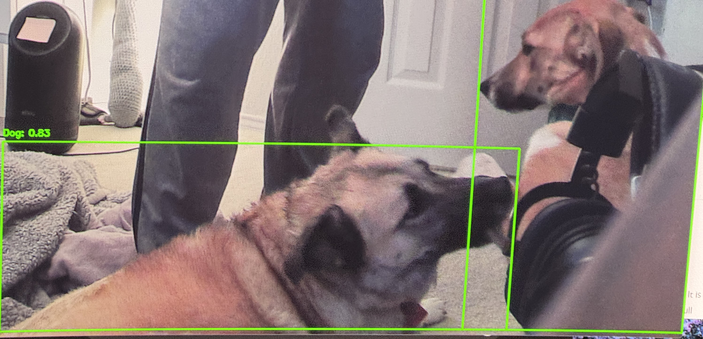

## Dog tracker

### Quickstart
1. install pytorch (with cuda enabled if supported) with this link [Pytorch](https://pytorch.org/get-started/locally/)
2. Install packages using poetry
3. Run program with `python main.py`

